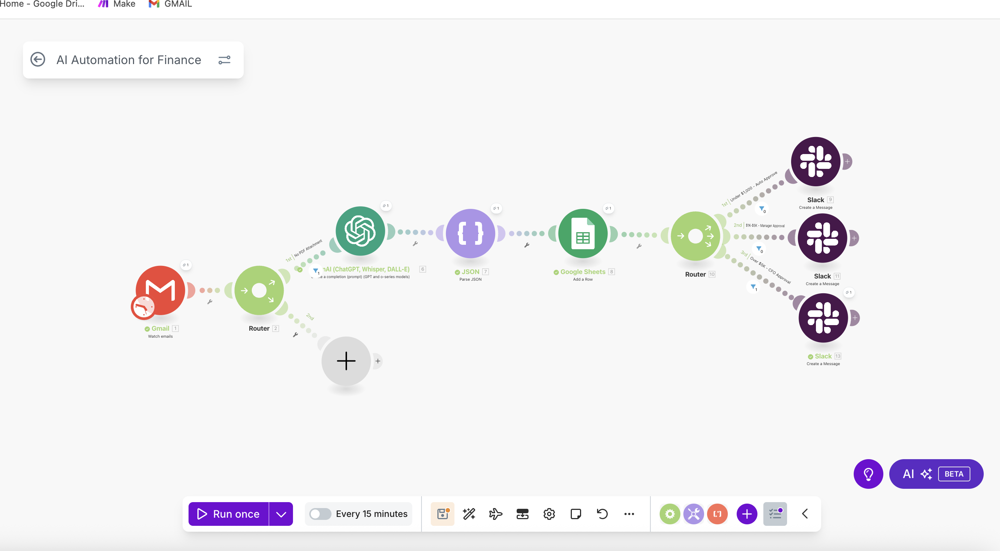
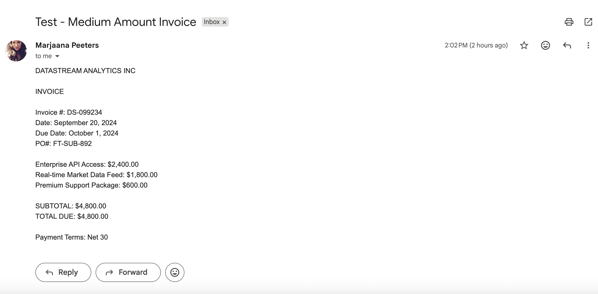
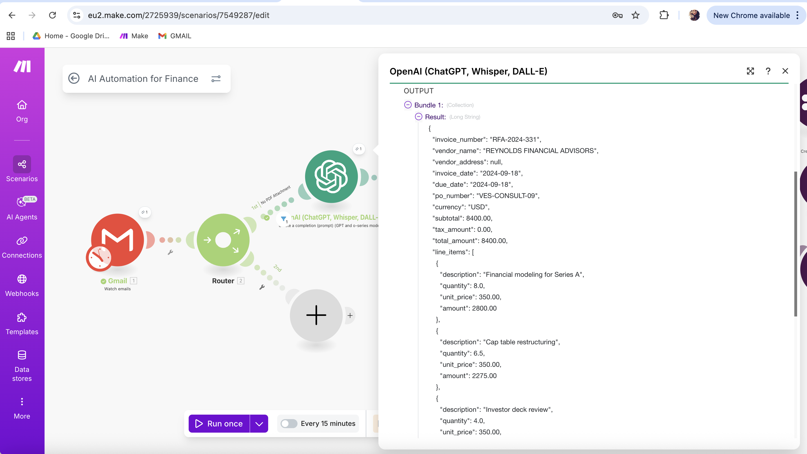
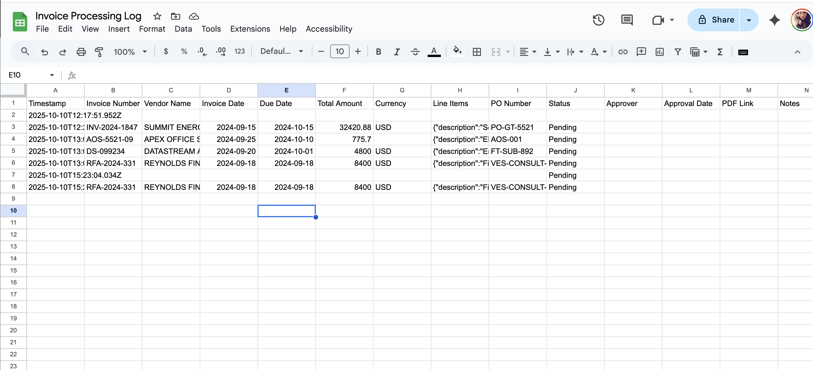
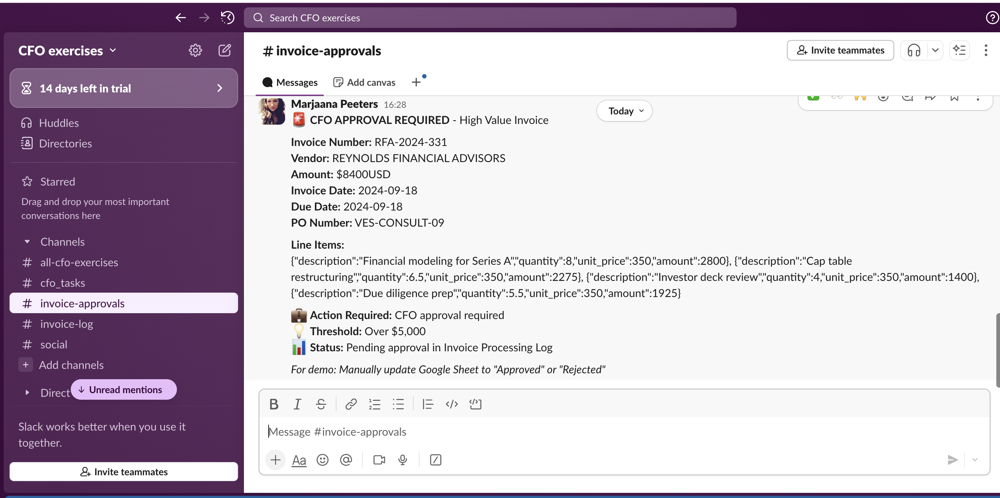

# AI-Powered Invoice Processing Automation

An intelligent invoice processing workflow built with Make.com, OpenAI GPT-4o, and multi-platform integrations. Automatically extracts invoice data, routes for approval based on amount thresholds, and logs to Google Sheets with Slack notifications.


## 🎯 Business Problem

Finance teams waste 15-30 minutes per invoice on manual data entry, approval routing, and record-keeping. This automation reduces processing time to under 30 seconds per invoice with 95%+ accuracy.

## ✨ Features

- **AI-Powered Data Extraction**: Uses OpenAI GPT-4o to extract structured data from invoice text
- **Smart Approval Routing**: Conditional logic routes invoices based on amount:
  - Under $1,000 → Auto-approved
  - $1,000-$5,000 → Manager approval
  - Over $5,000 → CFO approval
- **Multi-Platform Integration**: Gmail, Google Sheets, Slack, OpenAI
- **Structured Logging**: All invoices logged to Google Sheets with timestamps
- **Real-Time Notifications**: Slack alerts for approvals and auto-approved invoices

## 🏗️ Architecture

### Workflow Steps

1. **Email Trigger**: Gmail monitors inbox for new invoices
2. **AI Extraction**: OpenAI GPT-4o extracts:
   - Invoice number, vendor name, dates
   - Line items with quantities and amounts
   - Tax, subtotal, total amounts
   - Payment terms and PO numbers
3. **Data Parsing**: JSON parser structures the extracted data
4. **Logging**: Google Sheets records all invoice details
5. **Approval Routing**: Router directs based on total amount
6. **Notifications**: Slack messages sent to appropriate channels

### Technology Stack

- **Automation Platform**: Make.com
- **AI/ML**: OpenAI GPT-4o API
- **Email**: Gmail API
- **Database**: Google Sheets
- **Notifications**: Slack API
- **Data Format**: JSON

## 📊 Extracted Data Fields

- Invoice Number
- Vendor Name & Address
- Invoice Date & Due Date
- PO Number
- Currency
- Line Items (description, quantity, unit price, amount)
- Subtotal, Tax Amount, Total Amount
- Payment Terms

## 🚀 Demo

### Input: Invoice Text Email
SUMMIT ENERGY SOLUTIONS
Invoice #: INV-2024-1847
Date: September 15, 2024
Total: $32,420.88

### Output: Structured JSON
```json
{
  "invoice_number": "INV-2024-1847",
  "vendor_name": "SUMMIT ENERGY SOLUTIONS",
  "total_amount": 32420.88,
  "line_items": [...]
}

Result:

✅ Logged to Google Sheets
✅ Routed to CFO approval (over $5K)
✅ Slack notification sent

📈 Business Impact

Time Savings: 15-30 min → 30 seconds per invoice
Accuracy: 95%+ extraction accuracy
Scalability: Handles unlimited invoices
Cost: ~$0.02 per invoice (OpenAI API costs)

🔧 Technical Implementation
Make.com Scenario Configuration
Modules Used:

Gmail - Watch Emails (trigger)
Router (conditional logic)
OpenAI - Create Chat Completion (GPT-4o)
JSON - Parse JSON
Google Sheets - Add Row
Router (approval thresholds)
Slack - Create Message (×3 paths)

OpenAI Prompt Engineering
Custom system and user prompts ensure consistent JSON output with specific data structure. Temperature set to 0 for deterministic extraction.
Error Handling

Filter conditions prevent processing non-invoice emails
JSON parser validates structured output
Slack notifications confirm successful processing

📝 Current Limitations & Roadmap
Current Implementation
✅ Processes invoice text from email body
✅ Handles multiple currencies and formats
✅ Conditional approval routing
✅ Real-time logging and notifications

Known Limitations
⚠️ PDF Processing: Currently processes text-based invoices. PDF attachment processing requires additional integration:

Option A: Paid PDF extraction service (PDF4me, Adobe PDF Services)
Option B: Custom Gmail API integration for attachment handling
Option C: OCR service for scanned invoices

Future Enhancements

 PDF attachment processing
 OCR for scanned invoices
 Multi-currency conversion
 Vendor database integration
 Duplicate invoice detection
 Approval workflow automation (button clicks in Slack)
 Payment scheduling integration

🎓 Skills Demonstrated

AI Integration: OpenAI API, prompt engineering
Workflow Automation: Make.com scenario building
API Integrations: Gmail, Google Sheets, Slack
Data Transformation: JSON parsing, data mapping
Conditional Logic: Multi-path routing
Financial Processes: Invoice processing, approval workflows

📸 Screenshots

### Make.com Workflow Diagram


### Sample Invoice Input


### OpenAI Extraction Output


### Google Sheets Log


### Slack Notifications



🔐 Setup Requirements

Make.com account (free tier works)
OpenAI API key (GPT-4o access)
Gmail account
Google Sheets
Slack workspace

📧 Contact
Marjaana Peeters
Fractional CFO | AI Automation Specialist

LinkedIn: www.linkedin.com/in/marjaana-peeters-0442a4
Email: marjaanah@gmail.com
